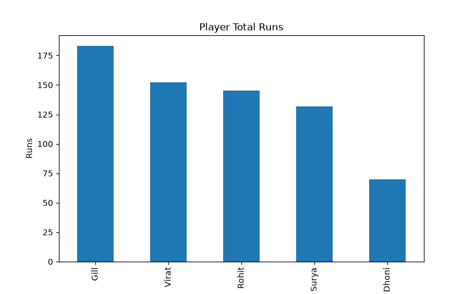
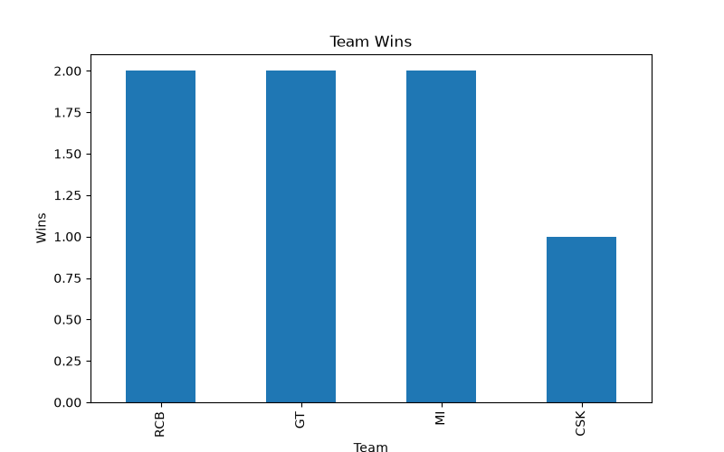
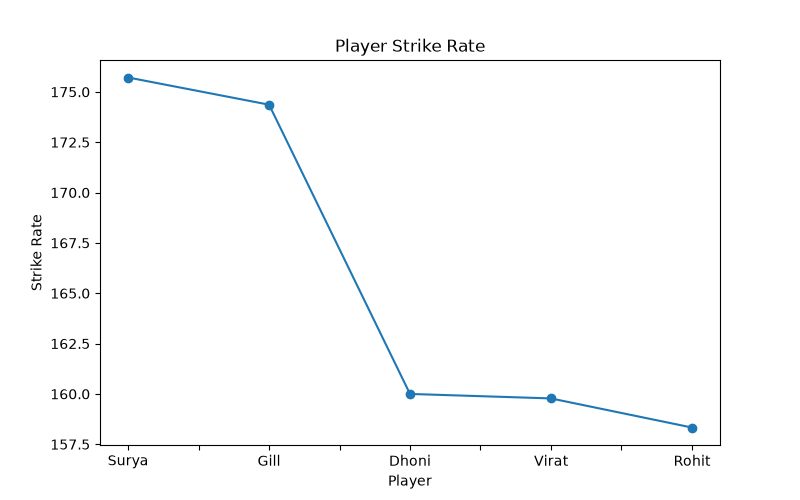
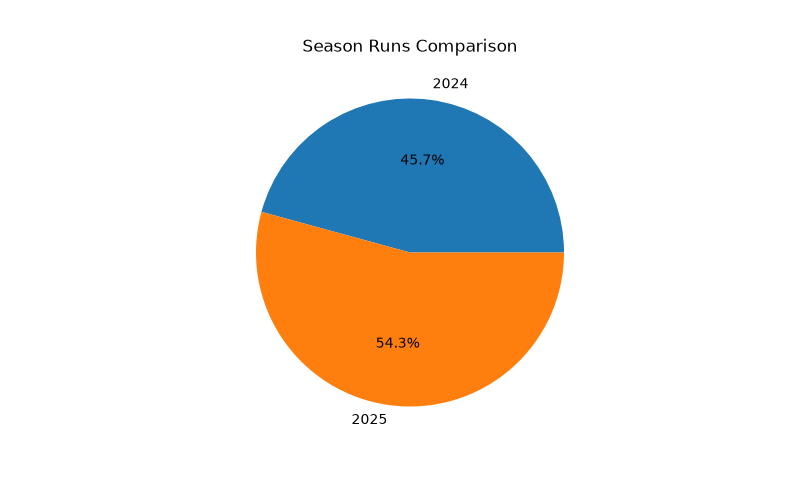

# IPL Cricket Data Analysis Project

This project is a Python-based IPL cricket data analysis script that uses a sample dataset to explore player performance, team outcomes, and season trends. It demonstrates how to manipulate data with Pandas, perform calculations with NumPy, and visualize insights with Matplotlib.

## Project Overview

The script analyzes cricket data and calculates:

- Total runs per player
- Strike rate per player
- Team-wise total runs
- Match results and win analysis
- Season comparison
- Visual reports in chart format

## Technologies Used

- Python
- Pandas
- NumPy
- Matplotlib

## Features

- Creates a sample IPL dataset
- Displays raw cricket data
- Calculates strike rate
- Finds top run scorers
- Checks best strike rate players
- Analyzes team performance and wins
- Ranks players by runs
- Saves generated analysis as CSV
- Produces charts for better visualization

## Project Files

- `IPL cricket data analysis project.py` - Main Python script
- `ipl_analysis_report.csv` - Generated output report
- `player_runs_chart.png` - Player total runs chart
- `team_wins_chart.png` - Team win chart
- `strike_rate_chart.png` - Player strike rate chart
- `season_comparison_chart.png` - Season comparison chart

## Charts Generated

### Player Total Runs


### Team Wins


### Player Strike Rate


### Season Comparison


## How to Run

1. Open the project folder.
2. Make sure Python is installed.
3. Install the required libraries:

```bash
pip install pandas numpy matplotlib
```

4. Run the script:

```bash
python "IPL cricket data analysis project.py"
```

## Output

When the script runs successfully, it will:

- print the cricket dataset and analysis results in the console
- generate charts in the same folder
- save the processed data to `ipl_analysis_report.csv`

## Author

This project is created as part of a Python data analysis learning exercise.

## License

This project is for educational and learning purposes.
